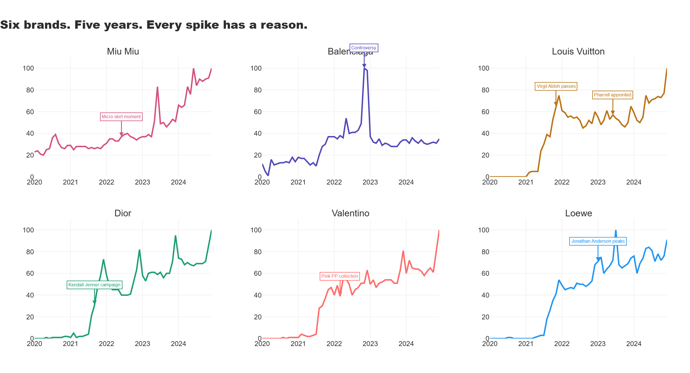

# The Half Life of Hype
*Hype has a half life. Turns out it's shorter than the PR team thinks.*

---

## The Hook

Fashion, apparently, is not just about what you wear. It is about 
what you choose and more importantly, when. The cerulean blue 
in your wardrobe did not arrive there by accident. It started 
somewhere. It moved through culture, through editorials, through 
celebrity dressing and street style and the quiet consensus of 
people who decide these things, until it landed in a discount bin 
and everyone stopped caring. That journey has a shape. And that 
shape has a half life.

This project is not written by someone who can identify a Birkin 
from across the room. It is written by someone who can tell you 
exactly when the internet decided Loewe was the most important 
brand on earth, down to the month and how long that moment 
lasted before the next one arrived. Fashion moves fast. Data 
keeps up.

Six brands. Five years. One question: when the hype arrives, 
how long before it starts to fade and which brands have figured 
out how to make it last?

---

## The Landscape



Six brands. Sixty months. Every spike has a reason.

Miu Miu never spiked, it compounded. Balenciaga hit 100 in 
November 2022 because 300 million TikTok views of 
#burnbalenciaga will do that to a Google Trends score. Louis 
Vuitton has two stories in one chart — grief and reinvention, 
in sequence. Loewe went from invisible to inevitable in 25 months 
and the data caught every step. The annotations tell you what 
happened. The lines tell you what it meant.

---

## What Makes This Different

- Can you actually measure how fast a brand's cultural moment arrives and build a metric for it?
- Does the speed of the rise predict how quickly it collapses?
- Which luxury brands convert a peak moment into sustained relevance  and which ones don't survive their own hype?
- Is The Dream quadrant, fast rise, high retention, even achievable? Or is it always vacant?
- What does Balenciaga's crisis, Miu Miu's dominance, and Loewe's slow burn look like when you put them all on the same axis?

---

## Key Findings

1. **The Dream quadrant is completely empty.** No brand in five years of data managed to build fast AND hold it. The fashion industry's most expensive real estate has no tenants.

2. **Miu Miu retained 90.5% of its peak interest in the six months after its June 2024 peak** — while posting 93.2% sales growth and winning Lyst's Brand of the Year two years running. That pink line doesn't spike because it never needed to.

3. **Balenciaga scored 18.10 hype velocity points per month** — the fastest rise in the dataset. It also retained only 36.6% of its peak. Outrage and admiration generate identical search behaviour. Only one of them keeps people coming back.

4. **Loewe scored 4.00 velocity points over 25 months and retained 72.5% efficiency.** Rihanna's Super Bowl. Beyoncé's Renaissance tour. Zendaya's tennis ball heels. Jonathan Anderson didn't manufacture cultural moments — he kept showing up to them until showing up became the brand identity.

5. **The fastest hype is always the least durable.** Velocity and efficiency move in opposite directions in this dataset. The brands that built slowest held the most. The data is not subtle about this.

---

## What A Brand Strategy Team Should Do With This

**Creative Directors —** The Hype Matrix tells you that the Dream quadrant is vacant, nobody has cracked fast AND durable in this dataset. The closest thing to it is Loewe, which built at 4.00 points per month over 25 months while dressing Rihanna, Beyoncé and Zendaya. The lesson is not to move faster. It is to keep showing up to the right moments consistently enough that the moments start showing up to you.

**Marketing Teams —** Balenciaga's November 2022 controversy generated a Google Trends score of 100 and a Lyst Index ranking of number eighteen in the same quarter. Viral reach and brand equity are not the same metric. A campaign that trends for a week can cost two years of brand equity. The velocity score tells you how loud the moment was. The efficiency score tells you whether it was worth it.

**Brand Managers —** Miu Miu's baseline interest score was 23.2 before its rise even started, the highest floor in this dataset. Every other brand began from near zero. That floor is not built by a campaign or a collection. It is built by a decade of cultural consistency that makes the brand searchable even in its quietest moments. The efficiency score rewards this. The velocity score ignores it entirely.

**Luxury Conglomerates —** Louis Vuitton, Dior and Valentino all peaked in December 2024, the last month of this dataset. Their efficiency scores are unwritten. What happens in the twelve months after a peak is the most commercially important question in luxury brand management. This framework gives you the tools to measure it in real time.

---

## The Custom Metrics

**Hype Velocity Score**
How fast did the brand build from baseline to peak?
`(Peak Score − Baseline) ÷ Months to Peak`
Higher score = faster rise. Explosive, unpredictable, harder to sustain.

**Hype Efficiency Score**
How much of the peak did the brand hold onto afterwards?
`(Average Post-Peak Interest ÷ Peak Score) × 100`
Higher score = more durable. Built on something real rather than a single moment.

---

## Project Structure
```
the-half-life-of-hype/
│
├── half_life_of_hype.ipynb         # Full annotated notebook
│
├── chart1_hype_map                 # Six brands, five years, every spike annotated
├── chart3_hype_velocity            # Hype Velocity Score — how fast did it arrive?
├── chart4_hype_efficiency          # Hype Efficiency Score — how long did it last?
└── chart5_hype_matrix              # The 2×2 matrix — velocity vs efficiency
│
│   All charts saved as .png and interactive .html
```


---

## Tech Stack

| Tool | Purpose |
|---|---|
| Python | Core analysis |
| pandas + NumPy | Data manipulation and custom metric calculation |
| Plotly | Interactive charts and the Hype Matrix |
| Google Trends | Interest index data — Worldwide, 2020–2024 |

---

## Data Source

**Google Trends — Worldwide Interest Index 2020–2024**
Downloaded manually for six brands: Miu Miu, Balenciaga, Louis 
Vuitton, Dior, Valentino and Loewe. Google Trends measures search 
interest on a scale of 0–100, where 100 represents peak popularity 
within the selected period. All values are relative, not absolute 
search volume, which makes cross-brand comparison methodologically 
honest. This dataset was chosen because it captures cultural 
temperature in real time, brand by brand, month by month. Press 
releases tell you what a brand wants you to think. Search interest 
tells you what people actually did.

---

## What I Learned

The most surprising finding was not in the charts, it was in 
the empty quadrant. I built the Hype Matrix expecting at least 
one brand to land in The Dream. None did. The fastest rise in 
the dataset belongs to Balenciaga's crisis. The highest 
efficiency belongs to Miu Miu's slow build. The data is making 
a very clear argument that speed and durability are incompatible 
in luxury hype and the fashion industry's obsession with the 
viral moment is precisely the wrong thing to optimise for.

The Balenciaga finding was the most commercially sobering. 
A holiday campaign featuring children with BDSM-inspired 
accessories generated 300 million TikTok views, a Google Trends 
score of 100, and a Lyst Index ranking of number eighteen in 
the same quarter. The controversy did not save the brand. It 
detonated it in slow motion. 36.6% efficiency is what's left 
when the outrage moves on. The velocity score looked impressive. 
The efficiency score told the truth.

Building the custom metrics was the most analytically satisfying 
part of this project. The Hype Velocity Score and Hype Efficiency 
Score don't exist anywhere in the industry's standard toolkit,
brand managers talk about these concepts qualitatively but nobody 
has put numbers on them using public data. The framework is 
replicable for any brand, any time period, any market. That 
scalability is intentional.

The Google Trends data has one important limitation worth stating 
clearly: it measures search interest, not sales, not sentiment, 
not brand equity. Louis Vuitton, Dior and Valentino all peaked 
in December 2024, the last month of the dataset — which means 
their post-peak stories are still being written. The Hype Matrix 
will look different in twelve months. That is not a flaw in the 
analysis. That is the point.

---

## About

**Trupthi Raj** — Data Analyst 

[GitHub](https://github.com/trupthiraj) · 
